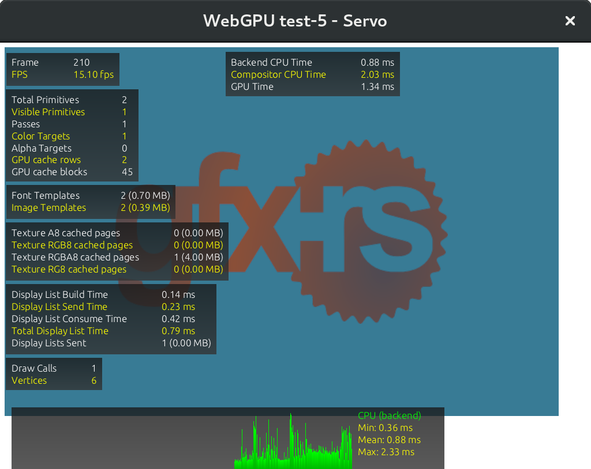

# webgpu-servo
[WebGPU](https://github.com/gpuweb/gpuweb) prototope in [Servo](https://github.com/servo/servo/) browser, backed by [gfx low-level core](https://github.com/gfx-rs/gfx).

## Latest renders



## Build instructions

Depenencies:
- Rust

```bash
git clone --recursive https://github.com/kvark/webgpu-servo
cd webgpu-servo/servo
./mach build -d
./mach run ../examples/05-image.html # for example
```
